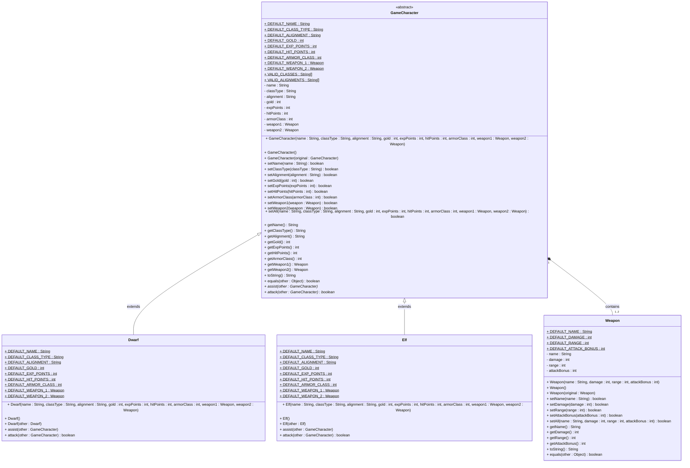

# **LAB 04 - D&D + Abstract Classes**

In this assignment, you'll be getting the back-end started for a Dungeons & Dragons (D&D or DnD) related program. Whether it is simulating an adventure or helping a player create their character, we need it to be flexible for those front-ends and more!

Below is a UML diagram showing the class inheritance to visualize the classes you will build for this project:

Here are the specifics of each class shown above with the requirements to look out for:

**`Weapon`:** This is a concrete class used for composition (has-a relationship) in ***`GameCharacter`***. Here are the specifications:

1. Create the 4 instance variables from the UML diagram above, with the specified types.
2. Create all required constructors for model classes (full, no-parameter, copy)
3. Create all required methods for model classes (setters, getters, toString, equals)
4. Error check that `int`s are >= 0, and `String`s are present (not null, length > 0)

---

***`GameCharacter`:*** This is an `abstract` class used as a base class for `Elf` and `Dwarf`. Here are the specifications:

1. Create the 9 instance variables from the UML diagram above, with the specified types.
2. Create all required constructors for model classes (full, no-parameter, copy)
3. Create all required methods for model classes (setters, getters, toString, equals)
	- This will be a lot of methods! Stay organized and vigilant to avoid copy/paste errors
4. Error check that `int`s are >= 0, and `String`s are present (not null, length > 0). Also, you can allow `Weapon` instance variables to be `null` (this would mean they do not have a weapon in that slot). Make sure to allow this and also deep copy!
5. Create 2 `abstract` methods, `assist` and `attack`, that both take in a *`GameCharacter`* object to interact with. Note the different return types (details below).

---

**`Elf`** and **`Dwarf`:** These are concrete derived classes from *`GameCharacter`*. Here are the specifications:

1. No instance variables to create! They have all the data needed in this basic design.
2. No extra required methods! They inherit all of them to maintain encapsulation.
3. Create all required constructors for model classes (full, no-parameter, copy)
4. Implement the two `abstract` methods, `assist` and `attack`, from *`GameCharacter`*. Depending on the class, it should have a different functionality that corresponds with the species:
    - `assist` will provide a positive action on the given *`GameCharacter`* parameter
      - For `Elf`, this can be healing (increasing `hitPoints` left), adding `gold`, etc.
      - For `Dwarf`, this can be adding `damage` amount to weapon(s), adding to `armorClass`, etc.
    - `attack` will simulate attacking the given *`GameCharacter`* parameter
      - For `Elf`, this can be decrement `hitPoints` based off of a characters `armorClass` and `expPoints` from a spell cast, for example.
      - For `Dwarf`, this can be decrement `hitPoints` based off of a characters `armorClass`and `Weapon` `damage` from a physical attack, for example.

The above suggestions for `assist` and `attack` are just that, suggestions. Feel free to get creative within the design of the classes above. In the future, you could add more data to the classes (such as strength, integrity, etc.) that could be used in modifying the `assist` and `attack` methods to add more interesting complexity!

Finally, update your `main` method and showcase the classes built by creating an object for one character. You can choose which species (`Elf` or `Dwarf`) to create, and all instance variables should be set appropriately. Make sure to print out the characters information to verify that all data was stored correctly.

# **Hacker Challenge**
Go crazy with it! Create a new species (Human, Orc, etc.), create a menu to have the user create multiple characters, or even start a small storyline to use that character they created to start a new adventure!

# **Additional Resources**
Here is some content that helped inspire the decisions above. You can use these and other D&D resources to inspire your hacker challenge:
- [Simple DND Character Explanation](https://simplednd.wordpress.com/creating-characters/character-sheet-explanation/)
- [D&D Starter Set Character Sheets](https://media.wizards.com/downloads/dnd/StarterSet_Charactersv2.pdf)
